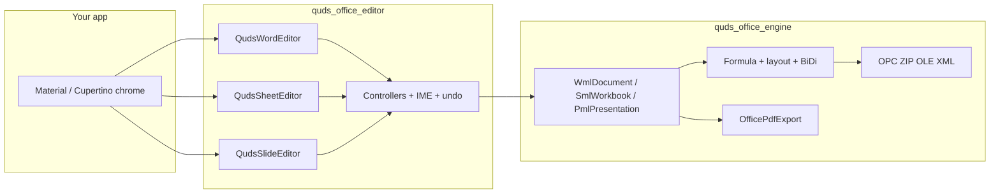

# Quds Office Suite

<p align="center">
  <strong>A production-grade Office stack for Dart and Flutter.</strong><br/>
  Pure Dart engine. Custom RenderBox editors. Word · Excel · PowerPoint · PDF.
</p>

<p align="center">
  <a href="https://pub.dev/packages/quds_office_engine"></a>
  <a href="https://pub.dev/packages/quds_office_editor"></a>
  <a href="LICENSE"></a>
  
  
</p>

---

Two packages. One suite. Publish and depend on each package **on its own**.

| Package | Runtime | What it is | pub.dev |
| --- | --- | --- | --- |
| **[`quds_office_engine`](packages/quds_office_engine)** | Pure Dart | OOXML + OPC/ZIP + formulas + PDF 1.7 | [pub.dev/packages/quds_office_engine](https://pub.dev/packages/quds_office_engine) |
| **[`quds_office_editor`](packages/quds_office_editor)** | Flutter | Interactive Word / Sheet / Slide / PDF surfaces | [pub.dev/packages/quds_office_editor](https://pub.dev/packages/quds_office_editor) |

```text
┌─────────────────────────────────────────────────────────────┐
│                     your Flutter / Dart app                 │
├──────────────────────────────┬──────────────────────────────┤
│     quds_office_editor       │     quds_office_engine       │
│  QudsWordEditor              │  Docx / Xlsx / Pptx builders │
│  QudsSheetEditor             │  Wml / Sml / Pml models      │
│  QudsSlideEditor             │  Formula engine              │
│  QudsPdfViewer / Editor      │  PdfFile + OfficePdfExport   │
│  custom RenderBox canvases   │  OfficePdfExport             │
│         │                    │  OfficeIsolateOpen / Save    │
│         └────────────────────┤  OPC · ZIP · OLE · XML       │
│                              │  BiDi · shaping · fonts      │
└──────────────────────────────┴──────────────────────────────┘
```

The engine **never** imports `dart:ui` or Flutter. The editor **never** uses
`TextField`, `ListView`, or `InteractiveViewer` for the document surface.

<p align="center">
  
  
  
  
</p>

---

## Why this suite

Most Dart “Office” libraries stop at writing a simple DOCX. Quds goes further:

- **Round-trip real files** — open Microsoft Office / LibreOffice packages, mutate the model, write them back.
- **Own the stack** — ZIP, Deflate, CFBF/OLE, XML, fonts, BiDi, and PDF are implemented here. Fewer mystery dependencies.
- **Many languages, many directions** — UAX #9 BiDi, Arabic shaping, mixed LTR/RTL, and logical caret movement live in the engine; the editor paints them.
- **Editors that look like Office** — paginated Word, virtualized Excel, a slide stage with Morph, wipe, push, and **reverse** slideshow playback.
- **Server or UI** — generate reports on a CLI/server with the engine; embed the same models in Flutter with the editor.

---

## Install

### Engine only (CLI, server, isolates, Flutter)

```yaml
dependencies:
  quds_office_engine: ^0.4.0
```

### Editor (pulls the engine)

```yaml
dependencies:
  quds_office_editor: ^0.4.0
```

This repository is a [Dart workspace](https://dart.dev/tools/pub/workspaces). From the root:

```bash
dart pub get
```

---

## 60-second engine tour

```dart
import 'dart:io';
import 'package:quds_office_engine/quds_office_engine.dart';

void main() {
  final theme = OfficeDocumentTheme.custom(
    palette: const OfficePalette(primary: '2B579A', accent: '217346'),
    rtl: true,
  );

  final docx = (DocxDocumentBuilder(theme: theme)
        ..heading('Quarterly report')
        ..paragraph('A pure Dart Office engine for many languages and directions.')
        ..table([
          ['Item', 'Value'],
          ['Files', '3'],
        ]))
      .build();

  final xlsx = (XlsxWorkbookBuilder(theme: theme)
        ..addSheet('Summary')
            .addRow(['Quarter', 'Revenue']))
      .build();

  final pptx = (PptxDeckBuilder(theme: theme)
        ..addCoverSlide(title: 'Quds Office', subtitle: 'Engine + Editor'))
      .build();

  File('report.docx').writeAsBytesSync(docx);
  File('book.xlsx').writeAsBytesSync(xlsx);
  File('deck.pptx').writeAsBytesSync(pptx);

  File('report.pdf').writeAsBytesSync(
    OfficePdfExport.fromBytes(docx, title: 'Quarterly report'),
  );
}
```

Full walkthrough: [`packages/quds_office_engine/README.md`](packages/quds_office_engine/README.md).

---

## 60-second editor tour

```dart
import 'package:flutter/widgets.dart';
import 'package:quds_office_editor/quds_office_editor.dart';

class WordHost extends StatefulWidget {
  const WordHost({super.key});
  @override
  State<WordHost> createState() => _WordHostState();
}

class _WordHostState extends State<WordHost> {
  late final WordEditorController controller = WordEditorController(
    config: const OfficeSurfaceConfig(
      textDirection: TextDirection.rtl,
      strings: OfficeStrings.english,
    ),
  );

  @override
  void initState() {
    super.initState();
    controller.insertHeading(text: 'New document');
  }

  @override
  void dispose() {
    controller.dispose();
    super.dispose();
  }

  @override
  Widget build(BuildContext context) {
    return QudsWordEditor(controller: controller);
  }
}
```

Same pattern for `SheetEditorController` + `QudsSheetEditor` and
`SlideEditorController` + `QudsSlideEditor`.

Full walkthrough: [`packages/quds_office_editor/README.md`](packages/quds_office_editor/README.md).

---

## Run the studio

The editor example is a desktop workspace (ribbons, samples, OS window chrome):

```bash
cd packages/quds_office_editor/example
flutter run
```

The engine example writes a gallery of Word / Excel / PowerPoint files **and** their PDFs:

```bash
cd packages/quds_office_engine
dart run example/rich_export_gallery.dart
```

---

## Architecture



| Layer | Lives in | Rule |
| --- | --- | --- |
| Models, IO, layout, formulas, PDF | `quds_office_engine` | No Flutter |
| Painting, hit-testing, IME, gestures | `quds_office_editor` | `RenderBox` / `LeafRenderObjectWidget` only |
| Ribbons, file dialogs, window buttons | **your** host (or the studio example) | Material is allowed here |

---

## Repository map

```text
quds_office_suite/
├── packages/
│   ├── quds_office_engine/     ← publish this to pub.dev
│   └── quds_office_editor/     ← publish this to pub.dev
├── docs/PUBLISHING.md
└── LICENSE                     MIT
```

---

## Publishing

Packages are published **separately**, engine first (the editor depends on it):

```bash
cd packages/quds_office_engine && dart pub publish
cd packages/quds_office_editor && flutter pub publish
```

Step-by-step, dry-run, and versioning: [`docs/PUBLISHING.md`](docs/PUBLISHING.md).

---

## Contributing

See [`CONTRIBUTING.md`](CONTRIBUTING.md). Issues and pull requests are welcome.

## License

[MIT](LICENSE) © Mohammed Asaad Asaad
