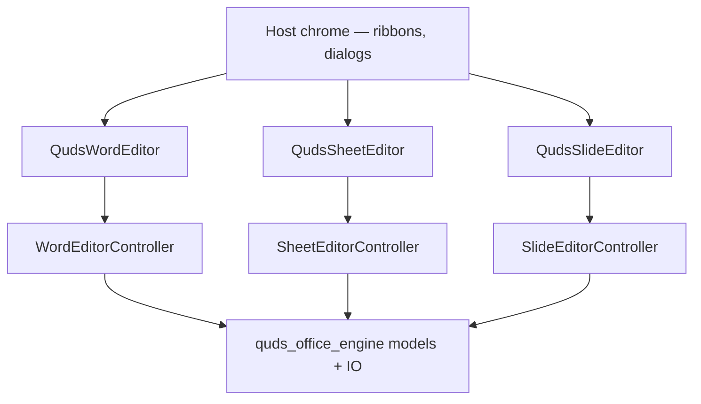

# quds_office_editor

<p>
  <a href="https://pub.dev/packages/quds_office_editor"></a>
  <a href="https://pub.dev/packages/quds_office_editor/score"></a>
  <a href="../../LICENSE"></a>
  
</p>

**Embeddable Word, Excel, and PowerPoint surfaces for Flutter** — built as
custom `RenderBox` editors, not `TextField` / `ListView` / `InteractiveViewer`.

This is the interaction half of [Quds Office Suite](https://github.com/MohammedAsaadAsaad/quds_office_suite).
Documents, formulas, layout, and PDF live in
[`quds_office_engine`](https://pub.dev/packages/quds_office_engine)
(re-exported from this package).

<p dir="rtl">
محرّرات وورد وإكسل وبوربوينت لـ Flutter: رسم مخصص، مؤشر ثنائي الاتجاه،
إدخال IME، معادلات، وعرض شرائح يمكن إرجاعه للخلف كفيديو عكسي.
</p>

---

## What you embed

| Widget | Controller | Surface |
| --- | --- | --- |
| `QudsWordEditor` | `WordEditorController` | Paginated pages, caret, tables, comments, headers/footers, OMML, pictures |
| `QudsSheetEditor` | `SheetEditorController` | Virtualized grid, formula bar, freeze panes, fill, charts |
| `QudsSlideEditor` | `SlideEditorController` | Slide stage, handles, snap guides, animations, fullscreen slideshow |

You draw **your** ribbon, file menu, and window chrome. The package paints
the document.

<p align="center">
  
  
  
</p>

```text
┌─ your Scaffold / desktop frame ──────────────────────────┐
│  toolbarBuilder  (optional — your ribbon)                │
│  ┌─────────────────────────────────────────────────────┐ │
│  │  QudsWordEditor / QudsSheetEditor / QudsSlideEditor │ │
│  │  RenderBox  ·  IME  ·  selection  ·  undo           │ │
│  └─────────────────────────────────────────────────────┘ │
│  statusBarBuilder (optional)                             │
└──────────────────────────────────────────────────────────┘
```

---

## Install

```yaml
dependencies:
  quds_office_editor: ^0.1.0
```

```bash
flutter pub add quds_office_editor
```

Requires Flutter **3.44+** and Dart **3.12+**. The engine comes along as
`quds_office_engine: ^0.1.0`.

---

## Word

```dart
import 'dart:typed_data';

import 'package:flutter/widgets.dart';
import 'package:quds_office_editor/quds_office_editor.dart';

class WordHost extends StatefulWidget {
  const WordHost({super.key, this.bytes});
  final Uint8List? bytes;
  @override
  State<WordHost> createState() => _WordHostState();
}

class _WordHostState extends State<WordHost> {
  late final WordEditorController controller = widget.bytes == null
      ? WordEditorController(
          config: const OfficeSurfaceConfig(
            textDirection: TextDirection.rtl,
            strings: OfficeStrings.arabic,
            theme: OfficeTheme.light,
          ),
        )
      : WordEditorController.fromBytes(widget.bytes!);

  @override
  void initState() {
    super.initState();
    if (widget.bytes == null) {
      controller.insertHeading(text: 'وثيقة جديدة');
    }
  }

  @override
  void dispose() {
    controller.dispose();
    super.dispose();
  }

  @override
  Widget build(BuildContext context) {
    return QudsWordEditor(
      controller: controller,
      toolbarBuilder: (context, c) {
        return const SizedBox.shrink(); // put your Home ribbon here
      },
    );
  }
}
```

Save:

```dart
final Uint8List docx = controller.saveBytes();
```

The Word canvas supports:

- Logical caret + IME (Arabic, Latin, CJK) without `EditableText`
- Bold / italic / underline / color / highlight / superscript
- Alignment, lists, indent, line spacing, RTL / LTR sections
- Tables (resize, select cells), pictures, charts, SmartArt-like diagrams
- Comments, hyperlinks, headers & footers, page breaks, TOC
- OMML equations
- Undo / redo, copy / cut / paste

---

## Excel

```dart
final controller = SheetEditorController.fromBytes(xlsxBytes);

QudsSheetEditor(
  controller: controller,
  frozenRows: 1,
  frozenCols: 1,
);
```

The grid is virtualized (`VirtualViewport`) so large sheets stay light.

- A1 selection, fill handle, row/column insert-delete
- In-cell editor + formula bar (`showFormulaBar`)
- Formula engine from the engine package (`SUM`, `IF`, `VLOOKUP`, …)
- Freeze panes, RTL sheets, number formats
- Embedded charts from the selection
- Recalc on edit; isolate open for big workbooks

```dart
controller.recalculateWorkbook();
final Uint8List xlsx = controller.saveBytes();
```

---

## PowerPoint

```dart
final controller = SlideEditorController.fromBytes(pptxBytes);

QudsSlideEditor(controller: controller);
```

Edit mode:

- Move / resize / rotate with transform handles
- Snap guides when edges align
- Shape text with the same inline editor used in cells
- Tables, pictures, charts, z-order
- Entrance / emphasis / exit / motion paths
- Slide transitions (fade, push, wipe, Morph, …)

Slideshow:

```dart
controller.startShow(from: 0);   // F5 in the studio example
controller.showNext();           // click / →
controller.showPrevious();       // reverse the last motion
controller.endShow();            // Esc
```

`showPrevious()` reverses **that** animation or **that** transition — fly-in
flies back out, a push slides back, a mid-fade retreats from the current
frame. It is not a jump to the previous slide’s final state.

---

## Theming and modes

```dart
const OfficeSurfaceConfig(
  mode: OfficeInteractionMode.editing, // or selecting, viewing
  theme: OfficeTheme.dark,
  textDirection: TextDirection.rtl,
  strings: OfficeStrings.arabic,
  showRulers: true,
  showFormulaBar: true,
  showGridlines: true,
  showSlideHandles: true,
  enableUndo: true,
);
```

| Mode | Caret / IME | Selection | Mutations |
| --- | --- | --- | --- |
| `editing` | Yes | Yes | Yes |
| `selecting` | No | Yes | No |
| `viewing` | No | No | No |

`OfficeTheme.light` and `OfficeTheme.dark` ship as starting palettes. Host
chrome (ribbons, panes) is **your** Material/Cupertino. Only the page, grid,
and stage are custom paint.

Bilingual chrome strings: `OfficeStrings.english` / `OfficeStrings.arabic`.

---

## Load, save, progress

```dart
await controller.loadBytesAsync(
  bytes,
  password: password,
  onProgress: (p) => setState(() => label = p.stage),
);

final Uint8List out = controller.saveBytes(password: optionalPassword);
```

Heavy opens run through `OfficeIsolateOpen` so a 20 MB deck does not freeze
the first frame.

---

## What this package refuses to be

The document surface is **not** a stack of Flutter text widgets.

| Forbidden on the canvas | Why |
| --- | --- |
| `TextField` / `TextFormField` / `EditableText` | Caret, BiDi, and pagination must be one engine |
| `SelectableRegion` | Selection is owned by the controller |
| `ListView` / `SingleChildScrollView` / `InteractiveViewer` | Virtualization and zoom are custom |

Use those widgets in **your** toolbar. Do not drop them onto the page.

---

## Studio example

A full bilingual workspace (File / Home / Insert / Layout / Review / View,
sample library, OS window frame):

```bash
cd packages/quds_office_editor/example
flutter run
```

See [`example/README.md`](example/README.md) for a guided tour of Word, Excel,
and PowerPoint.

---

## Architecture



| File | Role |
| --- | --- |
| `office_editors.dart` | Embeddable widgets + shortcuts + IME |
| `office_controller.dart` | Commands, selection, undo, load/save |
| `office_theme.dart` | Tokens, modes, bilingual strings |
| `render_word_canvas.dart` | Paginated Word `RenderBox` |
| `render_sheet_grid.dart` | Virtualized sheet `RenderBox` |
| `render_slide_stage.dart` | Slide + slideshow `RenderBox` |

---

## License

MIT © Mohammed Asaad Asaad
