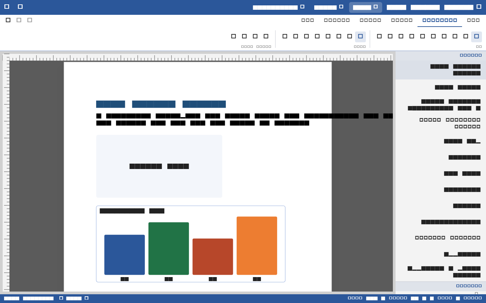
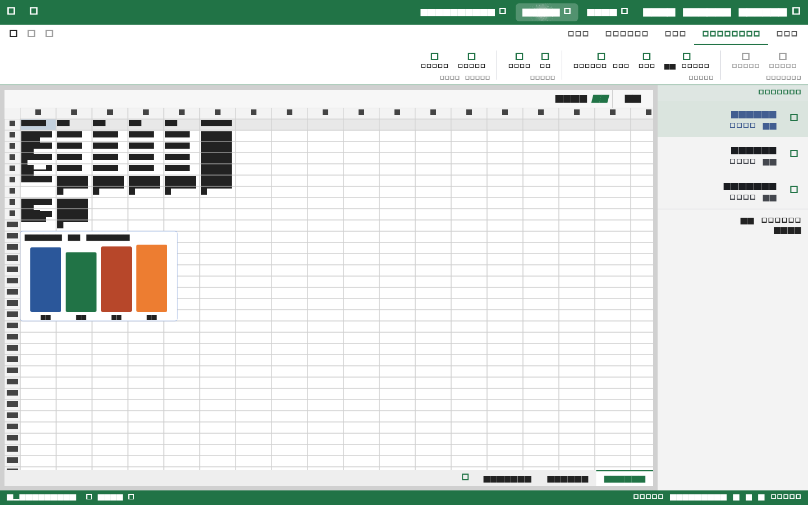
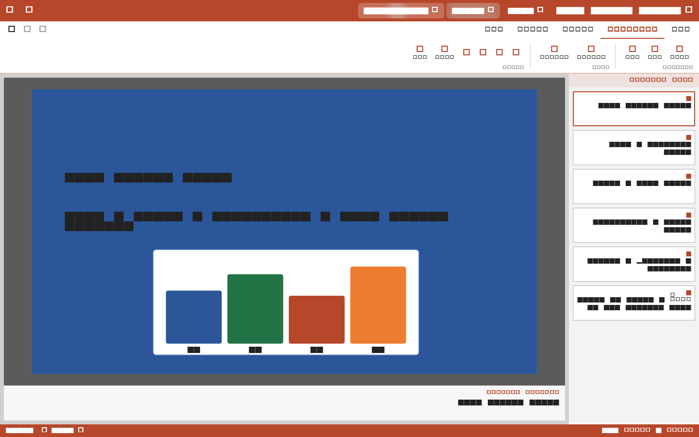
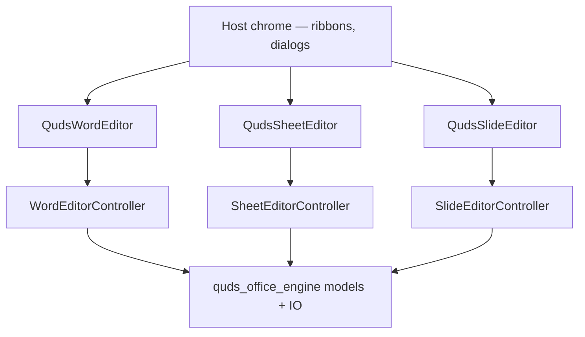

# quds_office_editor

<p>
  <a href="https://pub.dev/packages/quds_office_editor"></a>
  <a href="https://pub.dev/packages/quds_office_editor/score"></a>
  <a href="https://pub.dev/packages/quds_office_editor/score"></a>
  <a href="https://github.com/MohammedAsaadAsaad/quds_office_suite/blob/main/LICENSE"></a>
  
</p>

**Embeddable Word, Excel, PowerPoint, and PDF surfaces for Flutter** — painted as
custom `RenderBox` editors, not `TextField`, `ListView`, or `InteractiveViewer`.

This is the interaction half of
[Quds Office Suite](https://github.com/MohammedAsaadAsaad/quds_office_suite).
Documents, formulas, pagination, `PdfFile`, and `pdf_widgets` live in
[`quds_office_engine`](https://pub.dev/packages/quds_office_engine)
(re-exported from this package).

You draw **your** ribbon, file menu, and window chrome. This package paints the
document — Office **or** PDF.






---

## Why a custom RenderBox

A real Office canvas is one engine: caret, BiDi, IME, pagination, tables,
selection, and zoom must agree on the same coordinates.

Flutter’s text widgets are excellent for forms. They are the wrong primitive
for a paginated Word page, a virtualized sheet, or a slide stage with motion.

| Surface widget | Controller | What it paints |
| --- | --- | --- |
| `QudsWordEditor` | `WordEditorController` | Paginated pages, caret, tables, comments, headers/footers, OMML, pictures |
| `QudsSheetEditor` | `SheetEditorController` | Virtualized grid, formula bar, freeze panes, fill handle, charts |
| `QudsSlideEditor` | `SlideEditorController` | Slide stage, transform handles, snap guides, animations, slideshow |
| `QudsPdfViewer` | `PdfViewerController` | Read-only PDF pages, zoom, find, copy, follow links |
| `QudsPdfEditor` | `PdfEditorController` | Same canvas plus markup, form fill, page ops, incremental save |

```text
┌─ your Scaffold / desktop frame ──────────────────────────┐
│  toolbarBuilder  (optional — your ribbon)                │
│  ┌─────────────────────────────────────────────────────┐ │
│  │  QudsWordEditor / QudsSheetEditor / QudsSlideEditor │ │
│  │  RenderBox  ·  IME  ·  selection  ·  undo           │ │
│  └─────────────────────────────────────────────────────┘ │
│  statusBarBuilder (optional)                             │
└──────────────────────────────────────────────────────────┘
```

---

## Languages and writing directions

The editor is built for **many languages and many writing directions**, not a
single locale.

- **IME composition** — Latin, Arabic, Hebrew, CJK, and other system IMEs
  compose on the custom caret. There is no `EditableText` on the page.
- **Logical caret + visual runs** — the caret walks grapheme clusters; painting
  follows the engine’s UAX #9 BiDi and Arabic shaping.
- **Paragraph and section direction** — LTR, RTL, and mixed-direction
  documents. Windows/Linux-style Ctrl+Shift side shortcuts flip paragraph
  direction (`officeParagraphDirectionFromSides`).
- **Sheet direction** — worksheets can display right-to-left or left-to-right.
- **Host chrome locale** — `OfficeStrings` is a typed string table. Ship
  `OfficeStrings.english`, use the bundled second locale, or pass your own
  translations. The canvas itself does not hardcode UI copy.
- **Surface direction** — `OfficeSurfaceConfig.textDirection` sets the default
  for chrome and new content; users can still mix directions inside a file.

```dart
const OfficeSurfaceConfig(
  textDirection: TextDirection.rtl,
  strings: OfficeStrings.english, // or your own OfficeStrings(...)
);
```

The same document bytes open with the same layout in any host language. Locale
only changes chrome labels, not pagination.

---

## Install

```yaml
dependencies:
  quds_office_editor: ^0.3.0
```

```bash
flutter pub add quds_office_editor
```

Requires Flutter **3.44+** and Dart **3.12+**. The engine comes along as
`quds_office_engine: ^0.3.1`.

### Host fonts

The package ships Liberation Sans/Serif/Mono (PDF Standard 14 / Arial / Times /
Courier substitutes) and Noto Naskh Arabic. Register them once before paint:

```dart
void main() async {
  WidgetsFlutterBinding.ensureInitialized();
  await OfficeHostFonts.ensureRegistered();
  runApp(const MyApp());
}
```

Aliases such as Helvetica, Arial, Calibri, Times New Roman, and Courier New
resolve to those faces. When a PDF embeds its own `/FontFile*`, that face still
wins for glyph shape and advances.

---

## Word

```dart
import 'dart:typed_data';

import 'package:flutter/widgets.dart';
import 'package:quds_office_editor/quds_office_editor.dart';

class WordHost extends StatefulWidget {
  const WordHost({super.key, this.bytes});

  final Uint8List? bytes;

  @override
  State<WordHost> createState() => _WordHostState();
}

class _WordHostState extends State<WordHost> {
  late final WordEditorController controller = widget.bytes == null
      ? WordEditorController(
          config: const OfficeSurfaceConfig(
            textDirection: TextDirection.ltr,
            strings: OfficeStrings.english,
            theme: OfficeTheme.light,
          ),
        )
      : WordEditorController.fromBytes(widget.bytes!);

  @override
  void initState() {
    super.initState();
    if (widget.bytes == null) {
      controller.insertHeading(text: 'New document');
    }
  }

  @override
  void dispose() {
    controller.dispose();
    super.dispose();
  }

  @override
  Widget build(BuildContext context) {
    return QudsWordEditor(
      controller: controller,
      toolbarBuilder: (context, c) {
        return const SizedBox.shrink(); // put your Home ribbon here
      },
    );
  }
}
```

Save:

```dart
final Uint8List docx = controller.saveBytes();
```

The Word canvas supports:

- Logical caret + IME without `EditableText`
- Bold / italic / underline / color / highlight / superscript / subscript
- Alignment, lists, indent, line spacing, LTR / RTL sections
- Page size and orientation per **section** (portrait and landscape pages in
  one document; continuous column slices share one paper size)
- Horizontal pan and side gutters when a landscape page is wider than the view
- Interactive rulers (margins, indents, tabs)
- Tables (resize, select cells, merge), pictures, charts, diagrams
- Comments, footnotes/endnotes pane, hyperlinks, headers & footers
- Page breaks, section breaks, TOC
- OMML equations
- Find / replace, print, text statistics
- Undo / redo, copy / cut / paste

Orientation is a section property. Toggling landscape updates the caret
section **and** its continuous siblings (a heading plus a two-column body),
not a single laid-out page.

---

## Excel

```dart
final controller = SheetEditorController.fromBytes(xlsxBytes);

QudsSheetEditor(
  controller: controller,
  frozenRows: 1,
  frozenCols: 1,
);
```

The grid is virtualized (`VirtualViewport`) so large sheets stay light.

- A1 selection, fill handle, row/column insert-delete
- In-cell editor + formula bar (`showFormulaBar`)
- Formula engine from the engine package (`SUM`, `IF`, `VLOOKUP`, …)
- Freeze panes, RTL or LTR sheets, number formats
- Embedded charts from the selection
- Recalc on edit; isolate open for large workbooks

```dart
controller.recalculateWorkbook();
final Uint8List xlsx = controller.saveBytes();
```

---

## PowerPoint

```dart
final controller = SlideEditorController.fromBytes(pptxBytes);

QudsSlideEditor(controller: controller);
```

Edit mode:

- Move / resize / rotate with transform handles
- Snap guides when edges align
- Shape text with the same inline editor used in cells
- Tables, pictures, charts, z-order
- Entrance / emphasis / exit / motion paths
- Slide transitions (fade, push, wipe, Morph, …)

Slideshow:

```dart
controller.startShow(from: 0);   // F5 in the studio example
controller.showNext();           // click / →
controller.showPrevious();       // reverse the last motion
controller.endShow();            // Esc
```

`showPrevious()` reverses **that** animation or **that** transition — a fly-in
flies back out, a push slides back, a mid-fade retreats from the current
frame. It is not a jump to the previous slide’s final state.

---

## PDF viewer and editor

`QudsPdfViewer` is display-only (`viewing` / `selecting`): zoom, find, copy,
outline jump, follow URI. It has no `saveBytes`.

`QudsPdfEditor` extends the same canvas: highlights, notes, ink, AcroForm
values, page insert/delete/rotate, XFDF, incremental save.

```dart
final viewer = PdfViewerController.fromBytes(pdfBytes);
QudsPdfViewer(controller: viewer);

final editor = PdfEditorController.fromBytes(pdfBytes);
editor.highlightSelection();
final Uint8List saved = editor.saveBytes();
```

The page is `RenderPdfCanvas`. Host chrome (File / View / Annotate / Form)
stays outside the widget. Body-text reflow is out of scope.

---

## Theming, modes, and chrome

```dart
const OfficeSurfaceConfig(
  mode: OfficeInteractionMode.editing, // or selecting, viewing
  theme: OfficeTheme.dark,
  textDirection: TextDirection.ltr,
  strings: OfficeStrings.english,
  showRulers: true,
  showFormulaBar: true,
  showGridlines: true,
  showSlideHandles: true,
  showFindChrome: false,
  showNotesPane: false,
  showNavigationPane: false,
  enableUndo: true,
);
```

| Mode | Caret / IME | Selection | Mutations |
| --- | --- | --- | --- |
| `editing` | Yes | Yes | Yes |
| `selecting` | No | Yes | No |
| `viewing` | No | No | No |

`OfficeTheme.light` and `OfficeTheme.dark` ship as starting palettes. Host
chrome (ribbons, panes) is **your** Material or Cupertino. Only the page, grid,
and stage are custom paint.

`OfficeStrings` is a complete typed table (file, home, insert, layout, review,
view, find, notes, …). Provide another language by constructing
`OfficeStrings(...)`. The bundled extras are a starting point, not a limit.

Density (`OfficeDensity`) and form factor (`OfficeFormFactor`) let a host
tighten chrome on phone vs desktop without changing the document model.

---

## Load, save, progress

```dart
await controller.loadBytesAsync(
  bytes,
  password: password,
  onProgress: (p) => setState(() => label = p.stage),
);

final Uint8List out = controller.saveBytes(password: optionalPassword);
```

Heavy opens run through `OfficeIsolateOpen` so a large deck does not freeze
the first frame. Password-protected OOXML packages open when a password is
supplied.

The engine’s PDF export is one call away from any controller’s model:

```dart
final Uint8List pdf = OfficePdfExport.fromBytes(controller.saveBytes());
```

---

## What this package refuses to be

The document surface is **not** a stack of Flutter text widgets.

| Forbidden on the canvas | Why |
| --- | --- |
| `TextField` / `TextFormField` / `EditableText` | Caret, BiDi, and pagination must be one engine |
| `SelectableRegion` | Selection is owned by the controller |
| `ListView` / `SingleChildScrollView` / `InteractiveViewer` | Virtualization and zoom are custom |

Use those widgets in **your** toolbar. Do not drop them onto the page.

---

## Studio example

A full workspace (File / Home / Insert / Layout / Review / View, sample
library, OS window frame) lives under `example/`:

```bash
cd packages/quds_office_editor/example
flutter run
```

See [example/README.md](example/README.md) for a guided tour of Word, Excel,
and PowerPoint.

---

## Architecture



| File | Role |
| --- | --- |
| `office_editors.dart` | Embeddable widgets + shortcuts + IME |
| `office_controller.dart` | Commands, selection, undo, load/save |
| `office_theme.dart` | Tokens, modes, localizable strings |
| `office_clipboard.dart` | OOXML-aware copy / cut / paste |
| `render_word_canvas.dart` | Paginated Word `RenderBox` |
| `render_sheet_grid.dart` | Virtualized sheet `RenderBox` |
| `render_slide_stage.dart` | Slide + slideshow `RenderBox` |
| `render_pdf_canvas.dart` | Shared PDF page `RenderBox` |
| `office_ruler.dart` | Interactive Word ruler |
| `word_notes_pane.dart` | Footnotes / endnotes host pane |

---

## Design rules

- **Engine owns the model** — the editor never forks a second document format.
- **RenderBox only on the canvas** — no scrolling or text widgets as the page.
- **Host owns chrome** — ribbons, dialogs, and file pickers stay in your app.
- **Type-safe commands** — undoable mutations go through the controller, not
  ad-hoc widget state.

---

## License

MIT. See [LICENSE](LICENSE).
