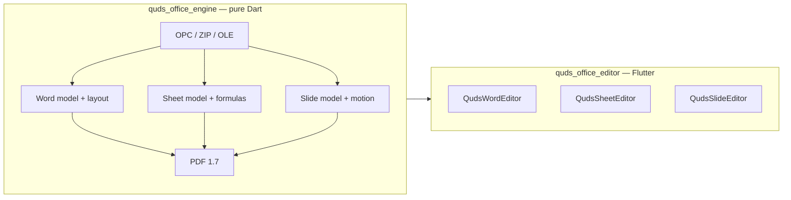

# quds_office_engine

<p>
  <a href="https://pub.dev/packages/quds_office_engine"></a>
  <a href="https://pub.dev/packages/quds_office_engine/score"></a>
  <a href="https://pub.dev/packages/quds_office_engine/score"></a>
  <a href="https://github.com/MohammedAsaadAsaad/quds_office_suite/blob/main/LICENSE"></a>
  
  
</p>

**A pure Dart Office Open XML engine.** Open, build, mutate, paginate, and export
`.docx`, `.xlsx`, and `.pptx` — then compile the same models to native **PDF 1.7**.

No Flutter. No `dart:ui`. No Microsoft Office, LibreOffice, or cloud conversion
step. You pass `Uint8List` in and you get `Uint8List` out.

This is the model, layout, and IO half of
[Quds Office Suite](https://github.com/MohammedAsaadAsaad/quds_office_suite).
Interactive canvases live in
[`quds_office_editor`](https://pub.dev/packages/quds_office_editor).

---

## Why this package exists

Most Dart “Office” libraries stop at a thin ZIP + XML writer, or they shell out
to a native binary. This engine owns the stack that a real suite needs:

| You need | What the engine does |
| --- | --- |
| Generate reports on a server | Fluent builders and a widget-style Word DSL return bytes |
| Open files people actually send | OPC package + WordprocessingML / SpreadsheetML / PresentationML |
| Spreadsheets that calculate | Formula AST, Excel-style functions, dependency graph |
| Text that reads correctly worldwide | Unicode, LTR / RTL / mixed BiDi, Arabic shaping, grapheme breaks |
| Print and archive | Native PDF 1.7 with subsetted fonts, images, links, outlines |
| Large files in a UI | Isolate open / save so the UI isolate stays responsive |
| Damaged or encrypted packages | Repair heuristics and password-aware Agile encryption |

The bytes are yours. There is no hidden “call a conversion API” step.

---

## Two packages, one suite



| Package | Runtime | Role |
| --- | --- | --- |
| **`quds_office_engine`** | Dart VM, web, Flutter | Documents, formulas, layout, PDF, extract |
| **`quds_office_editor`** | Flutter | Custom `RenderBox` Word / Excel / PowerPoint surfaces |

Use the engine alone for CLI tools, isolates, backends, and codegen. Add the
editor when a human needs to type, select, and present.

---

## Languages and writing directions

Office documents are not English-only, and this engine is not either.

The text pipeline is built for **many languages and many directions** in the
same file:

- **Unicode throughout** — Latin, Arabic, Hebrew, CJK, and mixed scripts in one
  run, paragraph, cell, or shape.
- **Paragraph and run direction** — left-to-right, right-to-left, and
  mixed-direction (BiDi) text.
- **UAX #9 BiDi** — embedding levels and visual reordering for mixed LTR/RTL.
- **Arabic shaping** — contextual forms and joining so connected scripts paint
  as words, not isolated letters.
- **Grapheme-aware line breaking** — caret-safe clusters, not naive `codeUnit`
  splits.
- **Sheet direction** — worksheets can be right-to-left (column A on the
  reading-start side) or left-to-right.
- **Theme-level default** — `OfficeDocumentTheme.custom(rtl: true)` seeds
  builders; individual paragraphs and runs can still override.

You do not need a separate “Arabic build” or “CJK build”. Pass the strings you
have; set direction where the document requires it.

```dart
final theme = OfficeDocumentTheme.custom(
  palette: const OfficePalette(primary: '2B579A', accent: 'C9A227'),
  rtl: true, // default writing direction for generated content
  page: OfficePageSize.a4Portrait,
);
```

For PDF, embed a covering TrueType face (or an `OfficeFontSet` with fallbacks)
so glyphs from every script you emit are subset into the file. Without a
covering `glyf` font, Latin may fall back to Helvetica and other scripts will
not appear.

---

## Install

```yaml
dependencies:
  quds_office_engine: ^0.2.0
```

```bash
dart pub add quds_office_engine
```

SDK: Dart **3.12+**. Works in Flutter apps, CLI tools, isolates, and web
(where `dart:io` is not required — pass `Uint8List` yourself).

Optional widget-style Word API:

```dart
import 'package:quds_office_engine/word_widgets.dart' as ww;
```

The default library stays Flutter-free. `word_widgets.dart` is still pure Dart;
it is only a document DSL, not a Flutter dependency.

---

## Word

Three layers, same `WmlDocument` model:

1. **Fluent builder** — `DocxDocumentBuilder` for reports and mail-merge-like
   generation.
2. **Widget DSL** — `package:quds_office_engine/word_widgets.dart`, shaped like
   `package:pdf/widgets.dart` (`Document`, `MultiPage`, `Paragraph`, `Table`,
   `Row` / `Column`, images, charts).
3. **Typed model** — `WmlDocument` / `WmlSection` / `WmlParagraph` / `WmlRun`
   for load, mutate, and round-trip serialize.

### Build a `.docx`

```dart
import 'dart:io';
import 'package:quds_office_engine/quds_office_engine.dart';

void main() {
  final theme = OfficeDocumentTheme.custom(
    palette: const OfficePalette(primary: '2B579A', accent: 'C9A227'),
    rtl: true,
  );

  final bytes = (DocxDocumentBuilder(theme: theme)
        ..header(left: 'Quds Office', right: 'Confidential')
        ..footer(left: 'Engine', right: 'Page')
        ..heading('Quarterly report')
        ..paragraph(
          'Executive summary in any Unicode script, including mixed direction.',
        )
        ..note('Generated without Microsoft Office.')
        ..bulletList(['Word', 'Excel', 'PowerPoint'])
        ..table([
          ['KPI', 'Q1', 'Q2'],
          ['Documents', '120', '148'],
          ['Slides', '36', '41'],
        ])
        ..hyperlink(
          'Documentation',
          'https://pub.dev/packages/quds_office_engine',
        )
        ..pageBreak()
        ..heading('Appendix', level: 2)
        ..barChart(
          title: 'Volume',
          series: const [
            ChartPoint(label: 'Q1', value: 120),
            ChartPoint(label: 'Q2', value: 148),
          ],
        ))
      .build();

  File('report.docx').writeAsBytesSync(bytes);
}
```

### Widget-style documents

Independent sections can change page size and orientation. A landscape
`MultiPage` in the middle of a portrait report is a real Word section, not a
rotated drawing.

```dart
import 'dart:typed_data';
import 'package:quds_office_engine/word_widgets.dart' as ww;

Future<void> writeReport() async {
  final doc = ww.Document(title: 'Quarterly', author: 'Quds Office');

  doc.addPage(
    ww.MultiPage(
      pageFormat: ww.PdfPageFormat.a4,
      build: (context) => <ww.Widget>[
        ww.Header(level: 1, text: 'Cover and summary'),
        ww.Paragraph(text: 'Portrait narrative, lists, and a table of contents.'),
        ww.TableOfContent(),
      ],
    ),
  );

  doc.addPage(
    ww.MultiPage(
      pageFormat: ww.PdfPageFormat.a4,
      orientation: ww.PageOrientation.landscape,
      build: (context) => <ww.Widget>[
        ww.Header(level: 1, text: 'Wide KPI table'),
        ww.Table.fromTextArray(
          headers: ['Region', 'Q1', 'Q2', 'Q3', 'Q4'],
          data: [
            ['North', '12', '14', '15', '18'],
            ['South', '9', '11', '10', '13'],
          ],
        ),
      ],
    ),
  );

  final Uint8List docx = await doc.save();
}
```

### Open and inspect

```dart
final document = WordDeserializer().readBytes(bytes);
final extracted = OfficeTextExtractor.extract(bytes, name: 'report.docx');
print(extracted.plainString);

final plain = DocxPlainReader.read(bytes);
print(plain.paragraphs);
print(plain.tables);
print(plain.hyperlinks);
```

The `WmlDocument` model covers runs, paragraphs, tables, **sections** (page
size, margins, columns, headers/footers), comments, footnotes/endnotes,
hyperlinks, bookmarks, fields, lists, styles, captions, citations, revision
marks, mail merge, TOC, drawings/frames, and OMML equations.

Layout (`WordLayout`) paginates that model into print-faithful pages. PDF
export and the Flutter Word canvas both consume the same laid-out pages.

---

## Excel

`XlsxWorkbookBuilder` is a styled writer. `SmlWorkbook` is the calculating
model.

### Write a workbook

```dart
final book = XlsxWorkbookBuilder(theme: theme);
final header = book.style(bold: true, fillRgb: '2B579A', color: 'FFFFFFFF');
final sheet = book.addSheet('Budget')
  ..rightToLeft = true
  ..freezeRows = 1
  ..addRow(['Item', 'Qty', 'Price'], style: header)
  ..addRow(['Paper', 40, 1.25])
  ..addRow(['Ink', 12, 8.5]);
sheet.columnWidths.add((min: 1, max: 3, width: 18));
File('budget.xlsx').writeAsBytesSync(book.build());
```

### Calculate formulas

```dart
final sheet = SmlWorksheet(name: 'Calc', sheetId: 1);
sheet.cellA1('A1').value = 10;
sheet.cellA1('A2').value = 20;
final total = sheet.cellA1('A3')..formula = '=SUM(A1:A2)';

final workbook = SmlWorkbook(sheets: [sheet]);
FormulaDepGraph(workbook).recalculate();
print(total.asNumber); // 30

final xlsx = SheetSerializer().writeBytes(workbook);
```

Supported families include:

| Family | Examples |
| --- | --- |
| **Math** | `SUM`, `AVERAGE`, `MIN`, `MAX`, `ROUND*`, `PRODUCT`, `POWER`, `SQRT`, `MOD`, `GCD`, `LCM`, `SUMPRODUCT` |
| **Logic** | `IF`, `IFS`, `IFERROR`, `IFNA`, `AND`, `OR`, `XOR`, `NOT`, `SWITCH` |
| **Lookup** | `VLOOKUP`, `INDEX`, `MATCH` |
| **Text** | `CONCAT` / `CONCATENATE`, `LEFT`, `RIGHT`, `MID`, `LEN`, `TRIM`, `UPPER`, `LOWER`, `SUBSTITUTE` |
| **Stat** | `COUNT`, `COUNTA`, `COUNTIF(S)`, `SUMIF(S)`, `AVERAGEIF`, `STDEV`, `VAR`, `MEDIAN` |
| **Date** | `DATE`, `TODAY`, `NOW`, and related serials |

Cross-sheet references and a dependency graph are part of the evaluator. This
is a serious subset, not a claim of full Excel compatibility.

Beyond the grid: styles, shared strings, freeze panes, RTL sheets, charts,
sparklines, and higher-level helpers (analysis, Power Query-shaped transforms,
solver) sit on the same `SmlWorkbook` model.

```dart
final names = XlsxGridReader.listSheets(xlsx);
final rows = XlsxGridReader.readSheet(xlsx, sheetIndex: 0);
```

---

## PowerPoint

```dart
final deck = (PptxDeckBuilder(theme: theme, showSlideNumber: true)
      ..addCoverSlide(
        title: 'Quds Office Engine',
        subtitle: 'OPC · Formulas · PDF',
      )
      ..addKpiSlide(
        title: 'This quarter',
        cards: [
          (label: 'Documents', value: '148'),
          (label: 'Decks', value: '41'),
        ],
      )
      ..addTitleBodySlide(
        title: 'Agenda',
        bullets: ['Builders', 'Models', 'Export'],
      )
      ..addPieChartSlide(
        title: 'Mix',
        series: const [
          ChartPoint(label: 'Word', value: 50),
          ChartPoint(label: 'Excel', value: 30),
          ChartPoint(label: 'Slides', value: 20),
        ],
      )
      ..addClosingSlide(title: 'Thank you', subtitle: 'quds_office_engine'))
    .build();

File('deck.pptx').writeAsBytesSync(deck);
```

`PmlPresentation` stores shapes, tables, notes, hidden slides, **animations**,
and **transitions** (including Morph). `PmlSlideShow` is a click-driven clock
the editor uses for a real slideshow:

```dart
final show = PmlSlideShow(presentation)..start(from: 0);
show.next();          // fire the next click, or transition forward
show.elapse(16);      // advance the clock
show.previous();      // reverse the last animation or the last transition
print(show.transitionProgress);
print(show.sample(shapeId).opacity);
```

`previous()` is not a jump. Entrances fly back out along the same path;
transitions replay as if the show were a video in reverse.

---

## PDF 1.7

The PDF writer is native. It does not wrap another PDF library.

```dart
// Any OOXML package:
final pdf = OfficePdfExport.fromBytes(docx, title: 'Report');

// Or from models:
OfficePdfExport.word(document, font: font, title: 'Word');
OfficePdfExport.workbook(workbook, font: font, title: 'Excel');
OfficePdfExport.presentation(
  presentation,
  font: font,
  title: 'Slides',
  mode: PdfSlideExportMode.notesPages,
);
```

| Source | What is drawn |
| --- | --- |
| Word | Laid-out pages, tables, headers/footers, visuals, TOC links, `/Outlines` |
| Excel | Evaluated grid: column widths, row heights, merges, optional `printArea` |
| PowerPoint | One page per slide (masters included), or notes pages, with bookmarks |

**Fonts:** embedded subsetting requires a TrueType face with a `glyf` table
(Calibri, Arial, DejaVu, Liberation, Noto, …). CFF/OTF-only faces are not
subset today. Pass an `OfficeFontSet` when one face cannot cover every script
in the file.

Direct PDF reports (no OOXML in the middle):

```dart
final pdf = (PdfReportBuilder(
      theme: theme,
      header: 'Quds',
      footer: 'Page',
    )
      ..titleText('Quarterly')
      ..body('Narrative…')
      ..kpiRow([(label: 'NPS', value: '72')])
      ..table([
        ['A', 'B'],
        ['1', '2'],
      ]))
    .build();
```

`OfficePrint` applies a page range, copy count, and optional landscape flag on
top of the same export path.

---

## Isolates, find, stats, properties

```dart
final payload = await OfficeIsolateOpen.word(
  bytes,
  onProgress: (p) => print('${p.stage} ${(p.value * 100).round()}%'),
);
final document = payload.document;
final laidOut = payload.laidOut;
```

The same isolate pattern exists for workbooks and presentations. Saves can run
on a worker isolate (`OfficeIsolateSave`).

```dart
final extracted = OfficeTextExtractor.extract(bytes, name: 'file.docx');
print(extracted.kind);        // word / sheet / slide / ODF / …
print(extracted.plainString);

final stats = OfficeTextStats.ofWord(document, laidOut: laidOut);
print('${stats.words} words · ${stats.pages} pages');

OfficeFind.replaceWord(
  document,
  const OfficeFindOptions(query: 'Q1', replaceWith: 'Q2'),
);
```

DOCX, XLSX, PPTX, and OpenDocument text/sheet/presentation extraction are
supported. PDF *text extraction* is not in this version — export *to* PDF, or
extract from OOXML.

Core/app document properties (`OfficeDocumentProperties`) round-trip with the
package. A lightweight spell helper (`OfficeSpell`) flags issues when a host
supplies a dictionary; the engine does not ship a full language corpus.

---

## Theming

Branding is injected through `OfficeDocumentTheme`. The engine does not
hardcode a product name into documents.

```dart
final theme = OfficeDocumentTheme.custom(
  palette: const OfficePalette(
    primary: '2B579A',
    accent: '217346',
    muted: '5B5B5B',
    highlight: 'C9A227',
  ),
  rtl: true,
  page: OfficePageSize.a4Portrait,
);
```

---

## Package layout

```text
lib/
├── quds_office_engine.dart              default export (no Flutter)
├── quds_office_engine_optional.dart     optional extras
├── word_widgets.dart                    Document / MultiPage DSL
└── src/
    ├── opc/        ZIP, relationships, content types, OLE, crypto, repair, isolates
    ├── xml/        Streaming reader / writer, Office namespaces
    ├── word/       WML model, layout, OMML math, widgets, serialize
    ├── sheet/      SML model, styles, formula AST + functions
    ├── slide/      PML model, DrawingML, animations, Morph, serialize
    ├── pdf/        PDF 1.7 document, fonts, images, Office export
    ├── bidi/       UAX #9, shaping, line breaker, office direction
    ├── fonts/      SFNT parse, metrics, subset, outlines, font set
    ├── builders/   Fluent DOCX / XLSX / PPTX writers
    ├── office/     find, print, stats, spell, properties
    └── extract/    Plain-text extraction
```

---

## Examples

| Script | Writes |
| --- | --- |
| [`example/engine_quickstart.dart`](example/engine_quickstart.dart) | One DOCX + PDF |
| [`example/word_widgets_sample.dart`](example/word_widgets_sample.dart) | Widget-style Word document |
| [`example/word_report_sample.dart`](example/word_report_sample.dart) | Multi-section report (portrait + landscape) |
| [`example/rich_export_gallery.dart`](example/rich_export_gallery.dart) | Word, Excel, PowerPoint galleries + PDF |
| [`example/word_gallery.dart`](example/word_gallery.dart) | Word-only |
| [`example/sheet_gallery.dart`](example/sheet_gallery.dart) | Excel-only |
| [`example/slide_gallery.dart`](example/slide_gallery.dart) | PowerPoint-only |

```bash
cd packages/quds_office_engine
dart run example/engine_quickstart.dart
dart run example/word_report_sample.dart
dart run example/rich_export_gallery.dart
```

---

## Compatibility

| Format | Read | Write | Notes |
| --- | --- | --- | --- |
| `.docx` | Yes | Yes | Sections, tables, drawings, comments, notes, TOC, OMML |
| `.xlsx` | Yes | Yes | Styles, formulas, freeze, RTL, charts |
| `.pptx` | Yes | Yes | Shapes, notes, hidden slides, motion |
| `.odt` / `.ods` / `.odp` | Extract | — | Text extraction |
| `.pdf` | — | Yes | Native 1.7 compile |
| Password-protected OOXML | Yes | Yes | When a password is supplied |

Files are intended to open in Microsoft Office, LibreOffice, and OnlyOffice.
Exotic VBA / ActiveX / legacy binary (`.doc` / `.xls` / `.ppt`) is out of scope.

---

## Design rules

- **100% type-safe** — no `dynamic`, no untyped maps in the public API.
- **`Uint8List` in, `Uint8List` out** — you own storage, networking, and
  encryption at rest.
- **No Flutter** — this package must stay embeddable in `dart:io` servers and
  isolates.
- **One layout, many surfaces** — pagination is computed here; PDF and the
  Flutter editor replay it.

Interactive editing lives in
[`quds_office_editor`](https://pub.dev/packages/quds_office_editor).

---

## License

MIT. See [LICENSE](LICENSE).
