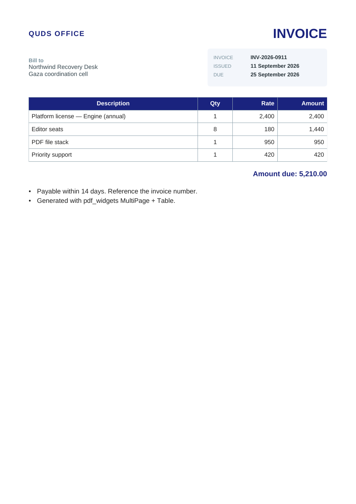

# quds_office_engine

<p>
  <a href="https://pub.dev/packages/quds_office_engine"></a>
  <a href="https://pub.dev/packages/quds_office_engine/score"></a>
  <a href="https://pub.dev/packages/quds_office_engine/score"></a>
  <a href="https://github.com/MohammedAsaadAsaad/quds_office_suite/blob/main/LICENSE"></a>
  
  
</p>

**A pure Dart Office and PDF engine.** Open, build, and write `.docx`, `.xlsx`,
and `.pptx`. Open real PDF files. Compose pages with a Flutter-like widget
layout. Pick from **100+ direction-aware report templates** with distinct
skins. Export Office models to native **PDF 1.7**. Assemble, rotate, stamp,
and crop PDF pages without a native library.

No Flutter. No `dart:ui`. No Microsoft Office, LibreOffice, or cloud conversion
step. You pass `Uint8List` in and you get `Uint8List` out.

This is the model, layout, and IO half of
[Quds Office Suite](https://github.com/MohammedAsaadAsaad/quds_office_suite).
Interactive canvases live in
[`quds_office_editor`](https://pub.dev/packages/quds_office_editor).

<p align="center">
  
  
</p>

---

## Why this package exists

Most Dart “Office” libraries stop at a thin ZIP writer, or they shell out to a
native binary. This engine owns the stack a real suite needs:

| You need | What the engine does |
| --- | --- |
| Generate reports on a server | Fluent builders and `pdf_widgets` return bytes |
| Open files people actually send | OPC packages **and** ISO 32000 `PdfFile` |
| Spreadsheets that calculate | Formula AST, Excel-style functions, dependency graph |
| Text that reads correctly worldwide | Unicode, LTR / RTL / mixed BiDi, Arabic shaping |
| Compose polished PDFs | Constraint layout (`Document` / `Table` / `MultiPage`) |
| Ship domain reports fast | `pdf_templates` — 100+ skins, not text-only clones |
| Print and archive from Office | Native PDF 1.7 with subsetted TrueType fonts |
| Rearrange an existing PDF | Graft pages so fonts and images survive |
| Large files in a UI | Isolate open and save so the UI isolate stays responsive |
| Damaged or encrypted packages | Repair heuristics and password-aware encryption |

The bytes are yours. There is no hidden conversion API.

---

## Two packages, one suite

```text
quds_office_engine          pure Dart, no dart:ui
├── OPC / ZIP / OLE         docx · xlsx · pptx
├── Word / Sheet / Slide    models, layout, formulas, motion
├── PdfFile                 open, display list, extract, annotate
├── PdfToolbox              merge, split, rotate, stamp, crop
├── pdf_widgets             constraint layout → PdfDocument
├── pdf_templates           100+ report skins on top of widgets
└── OfficePdfExport         Word / Excel / PowerPoint → PDF 1.7
         │
         ▼
quds_office_editor          Flutter RenderBox only
├── QudsWordEditor
├── QudsSheetEditor
├── QudsSlideEditor
└── QudsPdfViewer / QudsPdfEditor
```

| Package | Runtime | Role |
| --- | --- | --- |
| **`quds_office_engine`** | Dart VM, web, Flutter | Models, formulas, PDF file, widgets, export |
| **`quds_office_editor`** | Flutter | Custom `RenderBox` Word, Excel, PowerPoint, and PDF surfaces |

Use the engine alone for CLI tools, isolates, backends, and codegen. Add the
editor when a human needs to type, select, present, or annotate a PDF.

Three entry points. Do not mix them carelessly:

| Import | Use it for |
| --- | --- |
| `package:quds_office_engine/quds_office_engine.dart` | Office models, builders, formulas, `PdfFile`, export |
| `package:quds_office_engine/pdf_widgets.dart` | Flutter-like PDF layout (`Document`, `Text`, `Table`) |
| `package:quds_office_engine/pdf_templates.dart` | Classified report templates on top of the widgets |
| `package:quds_office_engine/quds_office_engine_optional.dart` | Optional PowerPoint media hydrate |

`pdf_widgets` is a **separate library** on purpose. Its `Text`, `TextStyle`,
and `Widget` names must not collide with Flutter. Import it with a prefix.

`pdf_templates` is a third library. It does not re-export the widgets.
Import it as `tpl` in a Flutter file so `TextDirection` does not collide.

`PdfDocument` is the **writer**. `PdfFile` is an **opened** ISO 32000 file.
They are parallel types. The writer is not renamed, and the file model does
not replace export.

---

## Languages and writing directions

Office documents are not English-only, and this engine is not either.

- **Unicode throughout** — Latin, Arabic, Hebrew, CJK, and mixed scripts in one
  run, paragraph, cell, or shape.
- **Paragraph and run direction** — left-to-right, right-to-left, and mixed
  BiDi in the same paragraph.
- **UAX #9** — embedding levels and visual reordering.
- **Arabic shaping** — joining forms, Lam-Alef ligatures, and a nominal map
  from presentation forms back to isolated letters (`ArabicShaper.nominal`).
- **Grapheme-aware line breaking** — caret-safe clusters, not naive code-unit
  splits.
- **Sheet direction** — a worksheet can be right-to-left (column A on the
  reading-start side) or left-to-right.
- **Theme default** — `OfficeDocumentTheme.custom(rtl: true)` seeds builders.
  Individual paragraphs and runs can still override.

You do not need a separate “Arabic build”. Pass the strings you have and set
direction where the document requires it.

```dart
final theme = OfficeDocumentTheme.custom(
  palette: const OfficePalette(
    primary: OfficeColors.wordBlue,
    accent: OfficeColors.antiqueGold,
  ),
  rtl: true,
  page: OfficePageSize.a4Portrait,
);
```

For PDF, embed a covering TrueType `glyf` face (or an `OfficeFontSet` with
fallbacks). Without one, Latin may fall back to Helvetica and other scripts
will not appear. A rotated watermark is one shaped string, not a letter split
along the diagonal — Arabic cannot be cut glyph by glyph and still join.

---

## Install

```yaml
dependencies:
  quds_office_engine: ^0.5.3
```

```bash
dart pub add quds_office_engine
```

SDK: Dart **3.12+**. Works in Flutter apps, CLI tools, isolates, and on the
web (pass `Uint8List` yourself; nothing in the public path requires
`dart:io`).

```dart
import 'package:quds_office_engine/quds_office_engine.dart';
import 'package:quds_office_engine/pdf_widgets.dart' as pw;
```

---

## Capability map

| Area | What you can do |
| --- | --- |
| **Word** | Build, open, mutate, and write DOCX. Sections, headers, footers, tables, lists, styles, comments, TOC, hyperlinks, fields, footnotes, endnotes, OMML, BiDi, mail merge, captions, citations, revisions |
| **Excel** | Build, open, and write XLSX. Shared strings, styles, merges, freeze, RTL, charts, pictures, named ranges, sparklines, a formula engine with a dependency graph |
| **PowerPoint** | Build, open, and write PPTX. Shapes, tables, notes, masters (subset), transitions and animations including Morph, reverse playback clock |
| **Office → PDF** | Replay Word layout, Excel grid, and slides (or notes pages, including two slides on one page) to PDF 1.7 with subsetted fonts, links, and outlines |
| **pdf_widgets** | Constraint layout: flex, text, tables, charts, images, TOC, headers, footers, watermarks. Synchronous `Document.save()` |
| **pdf_templates** | 100+ classified reports with **distinct `SheetSkin` layouts**, LTR/RTL, and brand themes |
| **PdfFile** | Open PDF 1.7, paint a display list, extract text, annotate, fill AcroForm, incremental save |
| **PdfToolbox** | Merge, extract, split, reorder, remove, rotate, reverse, insert, mix, stamp, number, Bates, crop — a new file with resources grafted |
| **Platform** | Own ZIP, Deflate, CFBF/OLE, XML, AES, repair, and isolate open/save |

What this package will **not** pretend to do is listed under
[Honest limits](#honest-limits).

---

## Word

Two layers, one `WmlDocument` model.

1. **Fluent builder** — `DocxDocumentBuilder` for reports and mail-merge style
   generation.
2. **Typed model** — `WmlDocument` / `WmlSection` / `WmlParagraph` / `WmlRun`
   for load, mutate, and round-trip serialize.

### Build a `.docx`

```dart
import 'dart:io';
import 'package:quds_office_engine/quds_office_engine.dart';

void main() {
  final theme = OfficeDocumentTheme.custom(
    palette: const OfficePalette(
    primary: OfficeColors.wordBlue,
    accent: OfficeColors.antiqueGold,
  ),
    rtl: true,
  );

  final bytes = (DocxDocumentBuilder(theme: theme)
        ..header(left: 'Quds Office', right: 'Confidential')
        ..footer(left: 'Engine', right: 'Page')
        ..heading('Quarterly report')
        ..paragraph(
          'Executive summary in any Unicode script, including mixed direction.',
        )
        ..note('Generated without Microsoft Office.')
        ..bulletList(['Word', 'Excel', 'PowerPoint'])
        ..table([
          ['KPI', 'Q1', 'Q2'],
          ['Documents', '120', '148'],
          ['Slides', '36', '41'],
        ])
        ..hyperlink(
          'Documentation',
          'https://pub.dev/packages/quds_office_engine',
        )
        ..pageBreak()
        ..heading('Appendix', level: 2)
        ..barChart(
          title: 'Volume',
          series: const [
            ChartPoint(label: 'Q1', value: 120),
            ChartPoint(label: 'Q2', value: 148),
          ],
        ))
      .build();

  File('report.docx').writeAsBytesSync(bytes);
}
```

### Open and inspect

```dart
final document = WordDeserializer().readBytes(bytes);
final extracted = OfficeTextExtractor.extract(bytes, name: 'report.docx');
print(extracted.plainString);

final plain = DocxPlainReader.read(bytes);
print(plain.paragraphs);
print(plain.tables);
print(plain.hyperlinks);
```

The model covers runs, paragraphs, tables, **sections** (page size, margins,
columns, headers and footers), comments, footnotes and endnotes, hyperlinks,
bookmarks, fields, lists, styles, captions, citations, revision marks, mail
merge, TOC, drawings, and OMML equations.

Fields that round-trip include PAGE, NUMPAGES, DATE, TIME, REF, SEQ, TOC,
CITATION, INDEX, HYPERLINK, FILENAME, FILESIZE, AUTHOR, TITLE, and MERGEFIELD.
This is a deliberate subset, not the entire Word field zoo.

`WordLayout` paginates the model into print-faithful pages. PDF export and
the Flutter Word canvas consume the same laid-out pages. A section can be
portrait or landscape independently of its neighbors.

---

## Excel

`XlsxWorkbookBuilder` is a styled writer. `SmlWorkbook` is the calculating
model.

### Write a workbook

```dart
final book = XlsxWorkbookBuilder(theme: theme);
final header = book.style(
  bold: true,
  fillRgb: OfficeColors.wordBlue,
  color: OfficeColors.white,
);
final sheet = book.addSheet('Budget')
  ..rightToLeft = true
  ..freezeRows = 1
  ..addRow(['Item', 'Qty', 'Price'], style: header)
  ..addRow(['Paper', 40, 1.25])
  ..addRow(['Ink', 12, 8.5]);
sheet.columnWidths.add((min: 1, max: 3, width: 18));
File('budget.xlsx').writeAsBytesSync(book.build());
```

### Calculate formulas

```dart
final sheet = SmlWorksheet(name: 'Calc', sheetId: 1);
sheet.cellA1('A1').value = 10;
sheet.cellA1('A2').value = 20;
final total = sheet.cellA1('A3')..formula = '=SUM(A1:A2)';

final workbook = SmlWorkbook(sheets: [sheet]);
FormulaDepGraph(workbook).recalculate();
print(total.asNumber); // 30

final xlsx = SheetSerializer().writeBytes(workbook);
```

Supported families include:

| Family | Examples |
| --- | --- |
| **Math** | `SUM`, `AVERAGE`, `MIN`, `MAX`, `ROUND`, `PRODUCT`, `POWER`, `SQRT`, `MOD`, `GCD`, `LCM`, `SUMPRODUCT` |
| **Logic** | `IF`, `IFS`, `IFERROR`, `IFNA`, `AND`, `OR`, `XOR`, `NOT`, `SWITCH` |
| **Lookup** | `VLOOKUP`, `INDEX`, `MATCH` |
| **Text** | `CONCAT`, `LEFT`, `RIGHT`, `MID`, `LEN`, `TRIM`, `UPPER`, `LOWER`, `SUBSTITUTE` |
| **Stat** | `COUNT`, `COUNTA`, `COUNTIF`, `SUMIF`, `AVERAGEIF`, `STDEV`, `VAR`, `MEDIAN` |
| **Date** | `DATE`, `TODAY`, `NOW`, and related serials |

Cross-sheet references and a dependency graph are part of the evaluator.
Unknown names return `#NAME?` rather than a silent wrong answer. A few names
are documented aliases; see `FormulaGuide`. This is a serious subset, not a
claim of full Excel compatibility.

Also on `SmlWorkbook`: styles, shared strings, freeze panes, RTL sheets,
charts, pictures, named ranges, tables, sparklines, print area and titles,
header and footer models, a simple SUM pivot (not Power Pivot), and a CSV
import helper (not Power Query).

```dart
final names = XlsxGridReader.listSheets(xlsx);
final rows = XlsxGridReader.readSheet(xlsx, sheetIndex: 0);
```

---

## PowerPoint

```dart
final deck = (PptxDeckBuilder(theme: theme, showSlideNumber: true)
      ..addCoverSlide(
        title: 'Quds Office Engine',
        subtitle: 'OPC · Formulas · PDF',
      )
      ..addKpiSlide(
        title: 'This quarter',
        cards: [
          (label: 'Documents', value: '148'),
          (label: 'Decks', value: '41'),
        ],
      )
      ..addTitleBodySlide(
        title: 'Agenda',
        bullets: ['Builders', 'Models', 'Export'],
      )
      ..addPieChartSlide(
        title: 'Mix',
        series: const [
          ChartPoint(label: 'Word', value: 50),
          ChartPoint(label: 'Excel', value: 30),
          ChartPoint(label: 'Slides', value: 20),
        ],
      )
      ..addClosingSlide(title: 'Thank you', subtitle: 'quds_office_engine'))
    .build();

File('deck.pptx').writeAsBytesSync(deck);
```

`PmlPresentation` stores shapes, tables, notes, hidden slides, animations, and
transitions (including Morph). `PmlSlideShow` is a click-driven clock the
editor uses for a real slideshow:

```dart
final show = PmlSlideShow(presentation)..start(from: 0);
show.next();          // fire the next click, or transition forward
show.elapse(16);      // advance the clock
show.previous();      // reverse the last animation or the last transition
print(show.transitionProgress);
print(show.sample(shapeId).opacity);
```

`previous()` is not a jump. Entrances fly back out along the same path.
Transitions replay as if the show were a video in reverse.

Shape presets and stroke are a subset of DrawingML. SmartArt is not
implemented. Audio and video are not on the default export; an optional
hydrate helper lives in `quds_office_engine_optional.dart`.

---

## PDF 1.7 — three ways

The writer is native. It does not wrap another PDF library.

### 1. Office → PDF

```dart
final pdf = OfficePdfExport.fromBytes(docx, title: 'Report');

OfficePdfExport.word(document, font: font, title: 'Word');
OfficePdfExport.workbook(workbook, font: font, title: 'Excel');
OfficePdfExport.presentation(
  presentation,
  font: font,
  title: 'Slides',
  mode: PdfSlideExportMode.notesPages,
  slidesPerPage: 2, // two slides stacked on one A4 page; default is 1
);
```

| Source | What is drawn |
| --- | --- |
| Word | Laid-out pages, tables, headers and footers, visuals, TOC links, `/Outlines` |
| Excel | Evaluated grid: column widths, row heights, merges, print area, print titles, header and footer |
| PowerPoint | One page per slide (masters included), or notes pages, with bookmarks and shape URI annotations |

Embedded subsetting requires a TrueType face with a `glyf` table (Calibri,
Arial, DejaVu, Liberation, Noto, …). CFF/OTF-only faces are not subset.
Pass an `OfficeFontSet` when one face cannot cover every script.

`OfficePrint` applies a page range, copy count, and optional landscape flag
on the same export path.

Direct reports that never touch OOXML:

```dart
final pdf = (PdfReportBuilder(
      theme: theme,
      header: 'Quds',
      footer: 'Page',
    )
      ..titleText('Quarterly')
      ..body('Narrative…')
      ..kpiRow([(label: 'NPS', value: '72')])
      ..table([
        ['A', 'B'],
        ['1', '2'],
      ]))
    .build();
```

Optional catalog extras (`PdfSaveOptions.pdfA`) write XMP, an OutputIntent,
and MarkInfo oriented toward PDF/A-2b. Tagged structure can be emitted from
outlines. That is **not** a certified PDF/A or PDF/UA file. Readers can
detect the XMP profile; a validator may still fail, especially after
incremental markup.

### 2. Widget composer (`pdf_widgets.dart`)

Constraint layout on a `PdfCanvas`. Flutter-shaped `Widget.layout` and
`PwBox.paint`, no `dart:ui`. `Document.save()` is synchronous and writes a
native `PdfDocument`. Subclass `Widget` for custom boxes.

```dart
import 'package:quds_office_engine/pdf_widgets.dart' as pw;

final doc = pw.Document(
  title: 'Invoice',
  font: font,
  fontBold: bold, // Type0 /F3 — real bold, not a faux stroke
);
doc.addPage(
  pw.MultiPage(
    pageFormat: pw.PdfPageFormat.a4,
    header: (c) => pw.Text('Quds Office'),
    footer: (c) => pw.Footer(),
    build: (c) => <pw.Widget>[
      pw.Header(level: 1, text: 'Invoice'),
      pw.Row(children: <pw.Widget>[
        pw.Expanded(child: pw.Paragraph(text: 'Bill to…')),
        pw.Expanded(child: pw.Paragraph(text: 'Due Net 14')),
      ]),
      pw.Table.fromTextArray(
        headers: ['Item', 'Amount'],
        data: [
          ['License', '2,400'],
        ],
      ),
      pw.Chart(
        type: pw.ChartType.bar,
        points: const [
          pw.ChartPoint(label: 'Q1', value: 12),
          pw.ChartPoint(label: 'Q2', value: 18),
        ],
      ),
      pw.Watermark.text('ATLAS'),
    ],
  ),
);
final Uint8List pdf = doc.save();
```

Implemented boxes include `Row`, `Column`, `Expanded`, `Wrap`, `Stack`,
`Positioned`, `GridView`, `Table` (cells fill the row), `Image`, `Chart`,
`UrlLink`, `Header`, `Footer`, `HeaderFooter`, `PageNumber`, `Paragraph`,
`Badge`, `Callout`, `Steps`, `DataGrid`, `Barcode`, `QrCode`, `SvgImage`,
`SignatureLine`, `KeepTogether`, a two-pass `TableOfContent`, and
`Watermark`.

A watermark is **one rotated string**. The content stream carries visual-order
glyphs under a rotation matrix, plus ActualText, so Arabic stays joined.
Splitting the word into upright letters is the wrong model for a connected
script.

Word does **not** have this DSL. OOXML is flow, not boxes. Generate DOCX with
`DocxDocumentBuilder`. Compose PDF pages with `pdf_widgets`.

### Report templates (`pdf_templates.dart`)

**100+ ready reports that look different from each other.** Labels are the
language. `TextDirection` is the layout. `TemplateTheme.copyWith` is the
brand. **`SheetSkin`** is the page composition — invoice, receipt, letter,
certificate, payslip split, checklist, route, voucher, grades, identity,
notice, journal, comparison, and more. Amounts stay formatted strings.

| Category | Templates |
| --- | --- |
| Commerce | Invoice, quote, receipt, delivery, purchase order, credit note, packing list, and more |
| Finance | Statement, expense, payslip, profit and loss, aging, vouchers, journal |
| People | Letter, certificate, offer, appointment, attendance, profile |
| Operations | Agenda, minutes, checklist, inspection, roster, incident, permit |
| Narrative | Memo, briefing, proposal, policy, decision |
| Data | KPI sheet, listing, scorecard, timesheet, risk register |
| Education | Report card, transcript, syllabus, fee receipt |
| Property | Rent receipt, lease summary, tenant statement |
| Logistics | Bill of lading, pick list, waybill, manifest |
| Programs | Grant report, distribution, donation receipt |

`TemplateCatalog.all` is the full index. Studio gallery samples are two
pages: English, then Arabic, in one PDF via `joinTemplateFiles`.

Named classes stay open for customization — grow with `SheetTemplate`,
`SheetSkin`, and `TemplateDocument.save` instead of forking a closed file.

```dart
import 'package:quds_office_engine/pdf_templates.dart' as tpl;

final bytes = tpl.InvoiceTemplate(
  direction: tpl.TextDirection.rtl,
  theme: tpl.TemplateThemes.commerce.copyWith(accent: '0F766E'),
  labels: const tpl.TradeLabels(document: 'فاتورة', from: 'من', to: 'إلى'),
  seller: const tpl.TemplateParty(name: 'الورشة'),
  buyer: const tpl.TemplateParty(name: 'الحيّ'),
  totals: const tpl.MoneyTotals(subtotal: '100', total: '100'),
).save();
```

Swap composition without rewriting the document:

```dart
tpl.SheetTemplate(
  kind: tpl.SheetKind.trade,
  skin: tpl.SheetSkin.receipt, // or invoice, voucher, route, …
  direction: tpl.TextDirection.ltr,
  theme: tpl.TemplateThemes.commerce,
  owner: const tpl.TemplateParty(name: 'North Dock'),
  labels: const tpl.SheetLabels(document: 'Receipt'),
).save();
```

### 3. Open a PDF (`PdfFile`)

```dart
import 'package:quds_office_engine/pdf_file.dart';

final PdfFile file = PdfFile.open(bytes, password: password);
print(file.pageCount);
print(PdfExtract.pageText(file, 0));
print(PdfExtract.documentText(file));

final PdfDisplayList list = file.displayList(0);
for (final PdfTextRun run in list.runs) {
  print('${run.text} @ ${run.x},${run.y}');
}

final hits = OfficeFind.inPdf(
  file,
  const OfficeFindOptions(query: 'Hello'),
);

file.addAnnot(0, PdfAnnot(id: 0, subtype: 'Highlight', rect: rect));
final Uint8List saved = PdfIncrementalSave.write(
  originalBytes: bytes,
  file: file,
);
```

Open covers xref tables and streams, object streams, and incremental updates.
Standard security revisions 2–4 open with a password; revisions 5 and 6 are
attempted. The display list includes paths through the CTM, fill and stroke
(including `b` / `b*`), clips, stroke style, DeviceRGB / Gray / CMYK (no ICC
apply — `/ICCBased` uses `/N` only), ExtGState opacity and a small blend set,
JPEG / Flate / LZW / CCITT images, image masks, indexed palettes, form
XObjects, inline images, Type 3 charprocs, axial and radial shadings, optional
content, and text with ToUnicode, WinAnsi, MacRoman, PDFDoc, and ActualText.

Annotations and appearance streams, AcroForm fill, XFDF, viewer preferences,
and page insert / delete / rotate live on `PdfFile`. `/XFA` is flagged, not
extracted. `/StructTreeRoot` is exposed; `PdfExtract.readingOrder` walks
Alt and ActualText. Signature fields report ByteRange coverage and, when
CMS `SignedData` is present, a `messageDigest` match (`valid` / `invalid` /
`unverified` / `broken` / `unsupported`). RSA/ECDSA and a system trust list
are **not** applied, and this package does not create signatures.

Isolate open: `OfficeIsolateOpen.pdf`. Print: `OfficePrint.pdfFile`.

---

## PDF toolbox

`PdfToolbox` writes a **new** PDF 1.7 and grafts each page dictionary, its
content streams, and inherited Resources. Fonts and images survive.
`PdfFile.appendPages` / `mergeFrom` use the same graft.

```dart
import 'package:quds_office_engine/pdf_file.dart';

// Concatenate, taking several range groups from one file.
final merged = PdfToolbox.merge(<PdfPageSource>[
  PdfPageSource(a, ranges: <String>['1-3', '8-10', '15']),
  PdfPageSource(b, ranges: <String>['2-4']),
]);

// One file, or one file per range group.
final one = PdfToolbox.extract(<PdfPageSource>[
  PdfPageSource(a, ranges: <String>['1-3', '8-']),
], mode: PdfExtractMode.oneFile);

final parts = PdfToolbox.extract(<PdfPageSource>[
  PdfPageSource(a, ranges: <String>['1-3', '8-10']),
], mode: PdfExtractMode.perRange);

final burst = PdfToolbox.split(bytes, const PdfSplitSpec.burst());
final chunks = PdfToolbox.split(bytes, const PdfSplitSpec.every(2));
final odds = PdfToolbox.split(bytes, const PdfSplitSpec.odd());
final byOutline = PdfToolbox.split(bytes, const PdfSplitSpec.bookmarks());

final turned = PdfToolbox.rotate(bytes, degrees: 90, ranges: <String>['1-3']);
final numbered = PdfToolbox.numberPages(bytes, pattern: '{n} / {N}');
final stamped = PdfToolbox.stamp(bytes, text: 'DRAFT', opacity: 0.18);
final cropped = PdfToolbox.crop(
  bytes,
  left: 12,
  bottom: 12,
  right: 12,
  top: 12,
);
```

Range language is 1-based: `1-3`, `5`, `8-`. A page may repeat if the range
repeats it. `PdfExtractMode.oneFile` concatenates groups. `perRange` yields
one file per group, so one source can contribute several outputs.

**`/Rotate` is a clockwise quarter-turn** (0 / 90 / 180 / 270), added to the
existing value and normalized. It does **not** swap MediaBox or reflow the
page. `PdfPageView.toView` / `fromView` map between unrotated crop space and
the view box (the view size swaps at 90° and 270°; that is the view box, not
an orientation conversion).

Stamp, page numbers, and Bates are a Helvetica overlay with `/ca` opacity.
They are Latin literals. Arabic in `stamp` throws — use `pdf_widgets`
`Watermark` when the word must shape and rotate as one string. Crop insets
the CropBox only. It does not rewrite the content stream.

Also: `reorder`, `remove`, `reverse`, `insertBlank`, `insertFrom`, `mix`,
and `resolveRange`.

---

## Isolates, find, stats, properties

```dart
final payload = await OfficeIsolateOpen.word(
  bytes,
  onProgress: (p) => print('${p.stage} ${(p.value * 100).round()}%'),
);
final document = payload.document;
final laidOut = payload.laidOut;
```

The same isolate pattern exists for workbooks, presentations, and PDF.
Saves can run on a worker isolate (`OfficeIsolateSave`).

```dart
final extracted = OfficeTextExtractor.extract(bytes, name: 'file.docx');
print(extracted.kind); // word / sheet / slide / ODF / …
print(extracted.plainString);

final stats = OfficeTextStats.ofWord(document, laidOut: laidOut);
print('${stats.words} words · ${stats.pages} pages');

OfficeFind.replaceWord(
  document,
  const OfficeFindOptions(query: 'Q1', replaceWith: 'Q2'),
);

final page = PdfExtract.pageText(PdfFile.open(pdf), 0);
final found = OfficeFind.inPdf(
  PdfFile.open(pdf),
  const OfficeFindOptions(query: page.substring(0, 4)),
);
```

Text extraction covers DOCX, XLSX, PPTX, OpenDocument, and PDF page text
(display-list runs, with redaction rectangles skipped). PDF find returns
hits with a page index. Replacing inside a PDF content stream is not
supported — Office replace is for Word, sheets, and slides.

Core and app document properties (`OfficeDocumentProperties`) round-trip with
the package. `OfficeSpell` flags issues when a host supplies a dictionary.
The engine does not ship a full language corpus.

---

## Theming

Branding is injected through `OfficeDocumentTheme`. The engine does not
hardcode a product name into documents.

```dart
final theme = OfficeDocumentTheme.custom(
  palette: const OfficePalette(
    primary: OfficeColors.wordBlue,
    accent: OfficeColors.excelGreen,
    muted: OfficeColors.gray,
    highlight: OfficeColors.antiqueGold,
  ),
  rtl: true,
  page: OfficePageSize.a4Portrait,
);
```

---

## Honest limits

These are not hidden TODOs. They are the contract.

| Out of scope | What you get instead |
| --- | --- |
| Legacy `.doc` / `.xls` / `.ppt`, VBA, ActiveX | OOXML only |
| Full Excel LAMBDA, Power Pivot, Power Query | Formula subset, simple SUM pivot, CSV helper |
| PDF body reflow (edit text like Word) | Annotations, form fill, page assembly |
| OCR, image recompress, PDF-to-Office layout recovery | Text extract from the content stream only |
| Creating signatures, full CMS/PAdES trust | ByteRange + `messageDigest` match (`valid`/`invalid`) |
| Certified PDF/A or PDF/UA | Optional XMP extras; detection, not certification |
| In-engine CFF / Type 1 raster, JPEG2000 | OTTO wrap for a host loader; JPX stays unsupported |
| JBIG2 arithmetic / symbol / text regions | MMR generic regions decode; other JBIG2 stays placeholder |
| True content-stream redaction | Overlay plus extract filter |
| Arabic `PdfToolbox.stamp` | Helvetica overlay; use `pw.Watermark` for a shaped string |
| N-up booklet, grayscale, image extract | Not in `PdfToolbox` |

---

## Package layout

```text
lib/
├── quds_office_engine.dart              default export (no Flutter)
├── quds_office_engine_optional.dart     optional extras
├── pdf_file.dart                        PdfFile, PdfToolbox, extract
├── pdf_widgets.dart                     constraint layout (separate library)
├── pdf_templates.dart                   classified report templates
└── src/
    ├── opc/        ZIP, relationships, OLE, crypto, repair, isolates
    ├── word/       WML model, layout, OMML, serialize
    ├── sheet/      SML model, styles, formula AST + functions
    ├── slide/      PML model, DrawingML, animations, Morph
    ├── pdf/        writer, widgets, and file/ open-annotate-graft
    ├── bidi/       UAX #9, shaping, line breaker, direction
    ├── fonts/      SFNT parse, metrics, subset, font set
    ├── builders/   Fluent DOCX / XLSX / PPTX writers
    ├── office/     find, print, stats, spell, properties
    └── extract/    Plain-text extraction
```

---

## Examples

| Script | Writes |
| --- | --- |
| [`example/engine_quickstart.dart`](example/engine_quickstart.dart) | One DOCX + PDF |
| [`example/word_report_sample.dart`](example/word_report_sample.dart) | Word report via `DocxDocumentBuilder` |
| [`example/pdf_widgets_invoice.dart`](example/pdf_widgets_invoice.dart) | Invoice (Row, Table, UrlLink) |
| [`example/pdf_widgets_report.dart`](example/pdf_widgets_report.dart) | Quarterly report (TOC, charts, landscape) |
| [`example/pdf_widgets_proposal.dart`](example/pdf_widgets_proposal.dart) | Proposal (cover band, GridView) |
| [`example/pdf_widgets_catalog.dart`](example/pdf_widgets_catalog.dart) | Bilingual catalog of every public widget |
| [`example/rich_export_gallery.dart`](example/rich_export_gallery.dart) | Word, Excel, PowerPoint galleries + PDF |
| [`example/word_gallery.dart`](example/word_gallery.dart) | Word-only |
| [`example/sheet_gallery.dart`](example/sheet_gallery.dart) | Excel-only |
| [`example/slide_gallery.dart`](example/slide_gallery.dart) | PowerPoint-only |

```bash
cd packages/quds_office_engine
dart run example/engine_quickstart.dart
dart run example/pdf_widgets_invoice.dart
dart run example/rich_export_gallery.dart
```

---

## Compatibility

| Format | Read | Write | Notes |
| --- | --- | --- | --- |
| `.docx` | Yes | Yes | Sections, tables, drawings, comments, notes, TOC, OMML |
| `.xlsx` | Yes | Yes | Styles, formulas, freeze, RTL, charts |
| `.pptx` | Yes | Yes | Shapes, notes, hidden slides, motion |
| `.odt` / `.ods` / `.odp` | Extract | — | Text extraction |
| `.pdf` | Yes | Yes | `PdfFile` open; native 1.7 write and toolbox graft |
| Password-protected OOXML | Yes | Yes | When a password is supplied |
| Password-protected PDF | Yes | Incremental | Standard security Rev 2–4; Rev 5/6 attempted |

Files are intended to open in Microsoft Office, LibreOffice, and OnlyOffice.
Fidelity is a library contract, not a claim against any single vendor product.

---

## Design rules

- **100% type-safe** — no `dynamic`, no untyped maps in the public API.
- **`Uint8List` in, `Uint8List` out** — you own storage and networking.
- **No Flutter** — embeddable in servers and isolates.
- **One layout, many surfaces** — pagination is computed here; PDF and the
  Flutter editor replay it.
- **Writer and file stay separate** — `PdfDocument` writes. `PdfFile` opens.

Interactive editing lives in
[`quds_office_editor`](https://pub.dev/packages/quds_office_editor).

---

## License

MIT. See [LICENSE](LICENSE).
